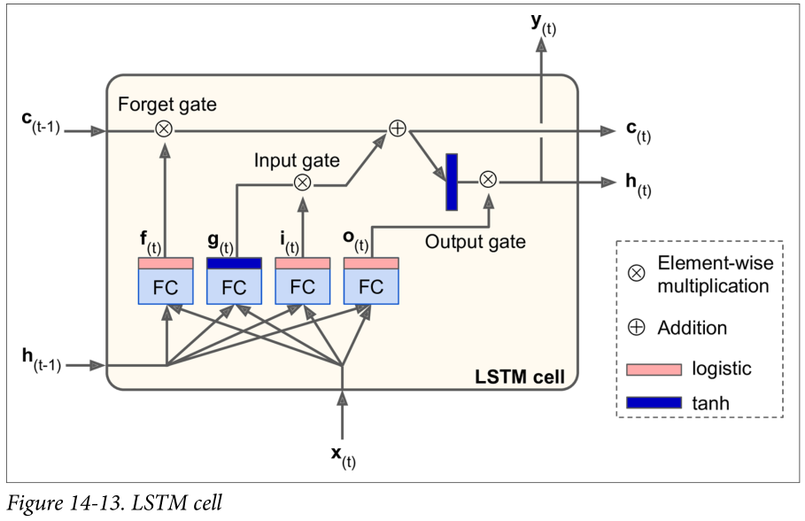
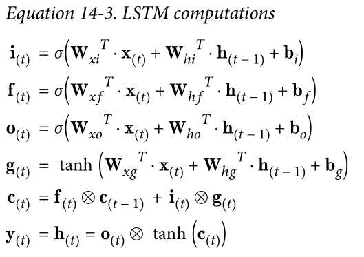
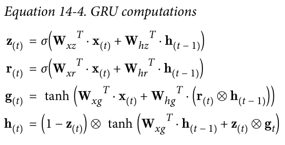

<!-- translation : alex cheen -->
### Creative RNN
### 生成RNN
到现在为止，我们已经训练了一个能够预测未来时刻样本值的模型，正如前文所述，可以用模型来生成新的序列。
为模型提供 长度为 **n_steps** 的种子序列, 比如全零序列，然后通过模型预测下一时刻的值；把该预测值添加到种子序列的末尾，用最后面 长度为 **n_steps** 的序列做为新的种子序列，做下一次预测，以此类推生成预测序列。
如图14-11所示，这个过程产生的序列会跟原始时间序列相似。


```python
sequence = [0.] * n_steps
for iteration in range(300):
	X_batch = np.array(sequence[-n_steps:].reshape(1, n_steps, 1)
	y_pred = sess.run(outputs, feed_dict={X: X_batch}
	sequence.append(y_pred[0, -1, 0]
```
如果你试图把约翰·列侬的唱片塞给一个RNN模型，看它能不能生成下一张《想象》专辑。
(note: 约翰·列侬 有一张专辑《Imagine》（1971)，这里取其双关的意思）
也许你需要一个更强大的RNN网络，它有更多的神经元，层数也更多。下面来探究一下深度RNN。
## 深度RNN
一个朴素的想法就是把一层层神经元堆叠起来，正如图14-12所示的那样，它呈现了一种深度RNN。

为了用TensorFlow实现深度RNN，可先创建一些神经单元，然后堆叠进 **MultiRNNCell** 。
以下代码中创建了3个相同的神经单元（当然也可以用不同类别的、包含不同不同数量神经元(neurons)的神经单元(cells))

```pyton
n_neurons = 100
n_layers = 3

basic_cell = tf.contrib.rnn.BasicRNNCell(num_units=n_neurons)
multi_layer_cell = tf.contrib.rnn.MultiRNNCell([basic_cell] * n_layers)
outputs, states = tf.nn.dynamic_rnn(multi_layer_cell, X, dtype=tf.float32)
```
这些代码就完成了这部分堆叠工作。**status** 变量包含了每层的一个张量(tensor)，这个张量就代表了该层神经单元的最终状态（维度为[**batch_size, n_neurons**])。
如果在创建**MultiRNNCell**时 设置了 **state_is_tuple=False**, 那么**status**变量就变成了单个张量，它包含了每一层的状态，其在列的方向上进行了聚合，（维度为[**batch_size, n_layers\*n_neurons**]。
注意在TensorFlow版本0.11.0之前，status是单个张量是默认设置。

## 在多个GPU上分布式部署深度RNN网络

<!-- todo later -->

## Dropout的应用

对于深层深度RNN，在训练集上很容易过拟合。Dropout是防止过拟合的常用技术。
可以简单的在RNN层之前或之后添加一层Dropout层，但如果需要在RNN层之间应用Dropout技术就需要**DropoutWrapper**。
下面的代码中，每一层的RNN的输入前都应用了Dropout，Dropout的概率为50%。
```python
keep_prob = 0.5

cell = tf.contrib.rnn.BasicRNNCell(num_units=n_neurons)
cell_drop = tf.contrib.rnn.DropoutWrapper(cell, input_keep_prob=keep_prob)
multi_layer_cell = tf.contrib.rnn.MultiRNNCell([cell_drop]*n_layers)
rnn_outputs, states = tf.nn.dynamic_rnn(multi_layer_cell, X, dtype=tf.float32)
```
同时也可以通过设置**output_keep_prob**来在输出应用Dropout技术。
然而在以上代码中存在的主要问题是，Dropout不管是在训练还是测试时都起作用了，而我们想要的仅仅是在训练时应用Dropout。
很不幸的时DropoutWrapper（还？）不支持 **is_training** 这样一个设置选项。因此必须自己写 Dropout包装类，或者创建两个计算图，一个用来训练，一个用来测试。后则可通过如下面代码这样实现。
```python
import sys
is_training  = (sys.argv[-1] == "train")

X = tf.placeholder(tf.float32, [None, n_steps, n_inputs])
y = tf.placeholder(tf.float32, [None, n_steps, n_outputs])
cell = tf.contrib.rnn.BasicRNNCell(num_units=n_neurons)
if is_training:
	cell = tf.contrib.rnn.DropoutWrapper(cell, input_keep_prob=keep_prob)
multi_layer_cell = tf.contrib.rnn.MultiRNNCell([cell]*n_layers)
rnn_outpus, status = tf.nn.dynamic_rnn(multi_layer_cell, X, dtype=tf.float32)

[...] # bulid the rest of the graph
init = tf.global_variables_initializer()
saver = tf.train.Saver()

with tf.Session() as sess:
	if is_training:
		init.run()
		for iteration in range(n_iterations):
			[...] # train the model
		save_path = saver.save(sess, "/tmp/my_model.ckpt")
	else:
		saver.restore(sess, "/tmp/my_model.ckpt")
		[...] # use the model
```
 通过以上的方法就能够训练各种RNN网络了。然而对于长序列的RNN训练还言之过早，事情会变得有一些困难。
 那么我们来探讨一下究竟这是为什么和怎么应对呢？
 
## 长时训练的困难
 
 在训练长序列的RNN模型时，那么就需要把RNN在时间维度上展开成很深的神经网络。正如任何深度神经网络一样，其面临着梯度消失/爆炸的问题，使训练无法终止或收敛。
 很多之前讨论过的缓解这种问题的技巧都可以应用在深度展开的RNN网络：好的参数初始化方式，非饱和的激活函数（如ReLU），批规范化（Batch Normalization）， 梯度截断（Gradient Clipping）， 更快的优化器。
即便如此， RNN在处理适中的长序列（如100输入序列）也在训练时表现的很慢。
最简单和常见的方法解决训练时长问题就是在训练阶段仅仅展开限定时间步长的RNN网络，一种称为截断时间反向传播的算法。
在TensorFlow中通过截断输入序列来简单实现这种功能。例如在时间序列预测问题上可以在训练时减小**n_steps**来实现截断。理所当然这种方法会限制模型在长期模式的学习能力。一种变通方案时确保缩短的序列中包含旧数据和新数据，从而使模型获得两者信息（如序列同时包含最近五个月的数据，最近五周的和最近五天的数据）。
问题时如何确保从去年的细分类中获取的数据有效性呢？这期间短暂但重要的事件对后世的影响，甚至时数年后这种影响是否一定要考虑在内呢（如选举结果）？这种方案有其先天的不足之处。
在长的时间训练过程中，第二个要面临的问题时第一个输入的记忆会在长时间运行的RNN网络中逐渐淡去。确实，通过变换的方式，数据穿流在RNN网络之中，每个时间步长后都有一些信息被抛弃掉了。那么在一定时间后，第一个输入实际上会在RNN的状态中消失于无形。
比如说，你想要分析长篇幅的影评的情感类别，影评以“I love this moive”开篇，并辅以各种改善影片的一些建议。试想一下，如果RNN网络逐渐忘记了开头的几个词，RNN网络的判断完全有可能会对影评断章取义。
为了解决其中的问题，各种能够携带长时记忆的神经单元的变体被提出。这些变体是有效的，往往基本形式的神经单元就不怎么被使用了。
首先了解一下最流行的一种长时记忆神经单元：长短时记忆神经单元LSTM。

## LSTM 单元
长短时记忆单元在1997年由S.H. 和 J.S.首次提出（https://goo.gl/j39AGv) [^3]，并在接下来的几年内经过A.G,H.S（https://goo.gl/6BHh81）[^4],W.Z(https://goo.gl/SZ9kzB)[^5] 等数位研究人员的改进逐渐形成。如果把LSTM单元看作一个黑盒，从外围看它和基本形式的记忆单元很相似，但LSTM单元会比基本单元性能更好，收敛更快，能够感知数据的长时依赖。TensorFlow中通过**BasicLSTMCell**实现LSTM单元。
[^3]: "Long Short-Term Memory," S.Hochreiter and J.Schmidhuber(1997)
[^4]: "Long Short-Term Memory Recurrent Neural Network Architectures for Large Scale Acoustic Modeling," H.Sak et al.(2014)
[^5]: "Recurrent Neural Network Regularization," W.Zaremba et al.(2015)

```python
lstm_cell = tf.contrib.rnn.BasicLSTMCell(num_units=n_neurons)
```

LSTM单元的工作机制是什么呢？在图14-13中展示了基本LSTM单元的结构。

不观察LSTM单元内部，除了一些不同外跟常规RNN单元极其相似。这些不同包括LSTM单元状态分为两个矢量：**h**<sub>(t)</sub>和**c**<sub>(t)</sub>(c代表cell)。可以简单认为**h**<sub>(t)</sub>是短期记忆状态，**c**<sub>(t)</sub>是长期记忆状态。
好，我们来打开盒子。LSTM单元的核心思想是其能够学习从长期状态中存储什么，忘记什么，读取什么。长期状态**c**<sub>(t-1)</sub>从左向右在网络中传播，依次经过遗忘门（**forget gate**）时丢弃一些记忆，之后加操作增加一些记忆（从输入门中选择一些记忆）。输出**c**<sub>(t)</sub>不经任何转换直接输出。每个单位时间步长后，都有一些记忆被抛弃，新的记忆被添加进来。另一方面，长时状态经过tanh激活函数通过输出门得到短时记忆**h**<sub>(t)</sub>，同时它也是这一时刻的单元输出结果**y**<sub>(t)</sub>。接下来讨论一下新的记忆时如何产生的，门的功能时如何实现的。

首先，当前的输入矢量**x**<sub>(t)</sub>和前一时刻的短时状态**h**<sub>(t-1)</sub>作为输入传给四个全连接层，这四个全连接层有不同的目的：

-  其中主要的全连接层输出**g**<sub>(t)</sub>，它的常规任务就是解析当前的输入**x**<sub>(t)</sub>和前一时刻的短时状态**h**<sub>(t-1)</sub>。在基本形式的RNN单元中，就与这种形式一样，直接输出了**h**<sub>(t)</sub>和**y**<sub>(t)</sub>。与之不同的时LSTM单元会将一部分**g**<sub>(t)</sub>存储在长时状态中。
- 其它三个全连接层被称为门控制**gate controllers**。其采用Logistic作为激活函数，输出范围在0到1之间。正如在结构图中所示，这三个层的输出提供给了元素积的乘操作，当输入为0时门关闭，输出为1时门打开。分别地：	
	- 忘记门（**forget gate**）由**f**<sub>(t)</sub>控制，来决定哪些长期记忆需要被擦出；
	- 输入门（**input gate**） 由**i**<sub>(t)</sub>控制，它的作用是处理哪部分**g**<sub>(t)</sub>应该被添加到长时状态中，也就是为什么被称为**部分存储**。
	- 输出门（**output gate**）由**o**<sub>(t)</sub>控制，在这一时刻的输出**h**<sub>(t)</sub>和**y**<sub>(t)</sub>就是由输出门控制从长时状态中读取的记忆。
简要来说，LSTM单元能够学习到识别重要输入（输入门作用），存储进长时状态，并保存必要的时间（忘记门功能），并学会提取当前输出所需要的记忆。
这也解释了LSTM单元能够在提取长时序列，长文本，录音等数据中的长期模式的惊人成功的原因。

方程式14-3总结了如何计算单元的长时状态，短时状态，和单个输入情形时每单位步长的输出（小批量的方程形式与单输入的形式相似）。

- **W**<sub>xi</sub>,**W**<sub>xf</sub>,**W**<sub>xo</sub>,**W**<sub>xg</sub>是四个全连接层关于输入矢量**x**<sub>(t)</sub>的权重。
- **W**<sub>hi</sub>,**W**<sub>hf</sub>,**W**<sub>ho</sub>,**W**<sub>hg</sub>是四个全连接层关于上一时刻的短时状态**h**<sub>(t-1)</sub>的权重。
- **b**<sub>i</sub>,**b**<sub>f</sub>,**b**<sub>o</sub>,**b**<sub>g</sub>,时全连接层的四个偏执项，需要注意的时TensorFlow初始化该项为全1矢量，而非全0，时阻止网络初始训练状态下各个门关闭从而忘记所有记忆。

### 窥孔连接
基本形式的LSTM单元中，门的控制仅有当前的输入**x**<sub>(t)</sub>和前一时刻的短时状态**h**<sub>(t-1)</sub>。不妨让各个控制门窥视一下长时状态，获取一些上下文信息不失为一种尝试。该想法（https://goo.gl/ch8xz3）由F.G.he J.S.在2000年提出。他们提出的LSTM的变体有叫做窥孔连接的额外连接：把前一时刻的长时状态**c**<sub>(t-1)</sub>加入忘记门和输入门的控制输入，当前时刻的长时状态加入输出门的控制输入。
TensorFLow中由LSTMCell实现以上变体LSTM，并设置use_peepholes=True.
```python
lstm_cell = tf.contrib.rnn.LSTMCell(num_units=n_neurons, use_peepholes=True)
```
在众多LSTM变体中，一个特别流行的变体就是GRU单元。

## GRU单元


门控循环单元（图 14-14）在2014年K.Cho et al.的论文(http://goo.gl/ZnAEOZ) 中提出,并在此文中也引入了前文所述的编码-解码网络。
门控循环单元时LSTM单元的简化版本，其能实现同样的性能，这也说明了为什么它能越来越流行。简化主要在一下几个方面：
- 长时状态和短时状态合并为一个矢量**h**<sub>(t)</sub>。
- 用同一个门控制忘记门和输入门。如果门控制输入1，输入门打开，忘记门关闭，反之亦然。也就是说，如果当有新的记忆需要存储，那么就必须实现在其对应位置事先擦除该处记忆。这也构成了LSTM本身的常见变体。
- GRU单元取消了输出门，单元的全部状态就是该时刻的单元输出。与此同时，增加了一个控制门**r**<sub>(t)</sub>来控制哪部分前一时间步的状态在该时刻的单元内呈现。

方程式14-4总结了如何计算单个输入情形时每单位步的单元的状态。
在TensoFlow中创建GRU单元很简单：
```python
gru_cell = tf.contrib.rnn.GRUCell(n_units=n_neurons)
```
